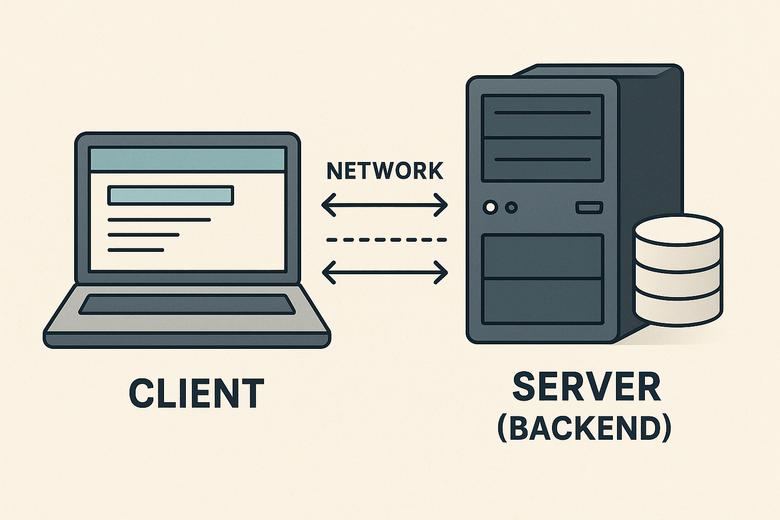

<!--
author:   Andrea Charão

email:    andrea@inf.ufsm.br

version:  0.0.1

language: PT-BR

narrator: Brazilian Portuguese Female

comment:  Material de apoio para a disciplina
          ELC117 - Paradigmas de Programação
          da Universidade Federal de Santa Maria

translation: English  translations/English.md


@load.java: @load(java,@0)

@load
<script style="display: block" modify="false" run-once="true">
    fetch("@1")
    .then((response) => {
        if (response.ok) {
            response.text()
            .then((text) => {
                send.lia("LIASCRIPT:\n``` @0\n" + text + "\n```")
            })
        } else {
            send.lia("HTML: <span style='color: red'>Something went wrong, could not load <a href='@1'>@1</a></span>")
        }
    })
    "loading: @1"
</script>
@end


-->

<!--
nvm use v14.21.1
liascript-devserver --input README.md --port 3001 --live
-->

[](https://liascript.github.io/course/?https://raw.githubusercontent.com/andreainfufsm/template-javalin-codespace/main/README.md)

# Web Service em Java



## Framework Javalin

- [Javalin](https://javalin.io/) é um framework em Java para desenvolvimento backend de aplicações web
- Comparável com [Scotty](https://hackage.haskell.org/package/scotty) (Haskell), [Flask](https://flask.palletsprojects.com/en/stable/) (Python) ou [Express.js](https://expressjs.com/) (JavaScript/Node.js)
- Mais leve que o popular Spring Boot (que usa demais as [Java Annotations](https://docs.oracle.com/javase/tutorial/java/annotations/) e acaba escondendo muito a orientação a objetos, por isso não vamos usá-lo)
- Dependências: requer algumas bibliotecas adicionais (já inclui um servidor HTTP)
- Gerenciamento de projeto / dependências com ferramentas Gradle ou Maven

## Exemplos

Avance para ver alguns exemplos com Javalin...

### Exemplo mínimo: hello


Arquivo: [HelloJavalin.java](javalin/src/main/java/demo/HelloJavalin.java)


@[load.java](javalin/src/main/java/demo/HelloJavalin.java)

Observações:

- Todo serviço em rede recebe requisições por uma porta (um número inteiro). Neste exemplo, é usada a porta definida por uma variável de ambiente `PORT` (ou, se não houver uma definida, é usada a porta 3000)

- Neste trecho de código, não há criação de objetos com `new`

  - `Integer.parseInt`, `System.getenv`, `Javalin.create` são "métodos de classe" (internamente declarados como `static`), por isso não são chamados com uma referência a um objeto (p.ex. this.method()), e sim com o nome da classe

    - Veja [no GitHub](https://github.com/javalin/javalin/blob/e3de3a956314cdc91569f2a80a6e4cfc6b5f0560/javalin/src/main/java/io/javalin/Javalin.java) a declaração da classe `Javalin`

- `app.get` é como uma função de alta ordem: recebe outro código (no caso, um lambda) que será executado quando alguém acessar a rota /

- `ctx -> ctx.result("Hello World")` é uma função anônima (lambda) que recebe o parâmetro `ctx` (um contexto da requisição, contendo dados como parâmetros, corpo, cabeçalhos etc.) e retorna uma resposta com a string "Hello World"


### Exemplo: random advice

- Um serviço que fornece conselhos aleatórios 😀 (constante `ADVICES`)
- Arquivo: [RandomAdviceService.java](javalin/src/main/java/demo/RandomAdviceService.java)
- Backend com resposta dinâmica: diferente da rota estática do exemplo anterior ("Hello"), aqui a resposta muda a cada requisição
- É usada a classe `ThreadLocalRandom` para obter um "sorteador"

@[load.java](javalin/src/main/java/demo/RandomAdviceService.java)


### Exemplo: random advice (JSON)

- Agora com resposta em formato JSON
- Arquivo: [RandomAdviceServiceJson.java](javalin/src/main/java/demo/RandomAdviceServiceJson.java)
- `ctx.json(Map.of`  faz o parsing da resposta JSON e extrai a string que se quer obter

@[load.java](javalin/src/main/java/demo/RandomAdviceServiceJson.java)


### Exemplo: POI service

- Exemplo que consulta um serviço de Pontos de Interesse
- Várias rotas: por exemplo, rota `/near/:lat/:lon` recebe parâmetros latitude e longitude e retorna aqueles mais próximos (filtragem da lista por distância)
- Usa `record` para guardar dados de pontos de interesse (`record` equivale a uma classe cujos objetos têm dados imutáveis)

  - Recurso incorporado a partir do JDK 16 (ver https://openjdk.org/jeps/395)

@[load.java](javalin/src/main/java/demo/PoiService.java)


### Exemplo: SQLite

- Integração de Javalin a um banco SQLite, salvando e consultando dados
- Muitas classes e métodos desconhecidos? Ótima oportunidade de descobrir mais detalhes sobre Java e relacioná-los com os conceitos de OOP

@[load.java](javalin/src/main/java/demo/SqliteService.java)


## Desenvolvimento no Codespaces


- Todos os códigos deste repositório são executáveis no Codespaces!
- Para isso:

  - Faça login no GitHub
  - Acesse a URL deste repositório
  - Clique no botão Code -> aba Codespaces -> Create codespace on main
  - Aguarde a criação... (leva algum tempo)


### Compilação e execução

- É fornecido um arquivo [Makefile](javalin/Makefile) que contém vários comandos para compilação, execução e teste
  
  - Os comandos do Makefile também podem ser executados manualmente no terminal!

- O [Makefile](javalin/Makefile) é usado pelo programa `make`, que está instalado no Codespaces
- Para executar o serviço `HelloJavalin`:

  ``` bash
  make hello
  ```
- Para executar outros serviços, substitua `hello` por um destes outros serviços: `advice-text`, `advice-json`, `poi` ou `sqlite` 
- Se tudo correr bem, ao iniciar um serviço vai ser criado um servidor web que atenderá às requisições


### Teste

- Para testar cada exemplo, vai ser preciso fazer requisições web para as rotas 
- Todos exemplos aceitam requisições GET (leitura), que podem ser enviadas pelo navegador na URL
- O exemplo com SQLite também aceita POST (escrita), que precisa de parâmetros
- No Codespaces, é possível expor o serviço (escolher modo Public) com uma URL externa e acessá-la pelo computador local

